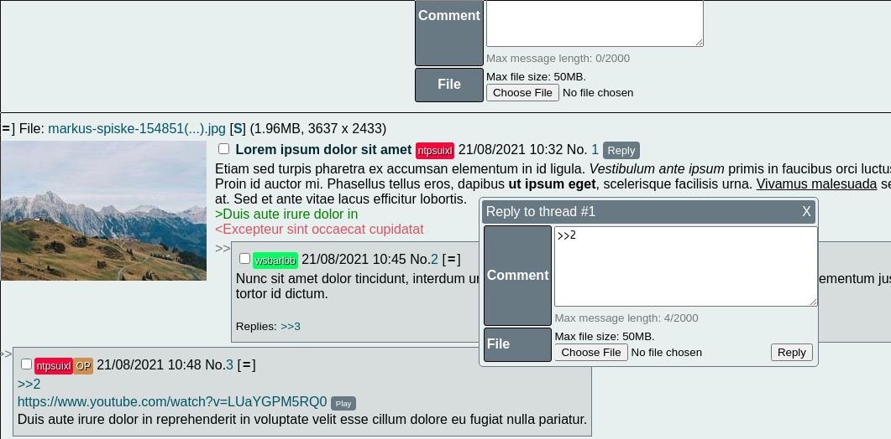

# Imageboard

## Features
- Simple markdown: bold (**), italic (*) and underline (__)
- Green (>) and Pink (<) text
- Quick replies
- Reply previews
- Mod and Admin functions
- Youtube embeds
- Mobile responsive design (through CSS media queries)

## Dependencies
- bottle: Web framework.
- filetype: To make sure people upload valid files.
- Pillow: To create thumbnails and get image dimensions.
- waitress: Production server.
- peewee: SQL ORM.

## Guide
1. Clone the repository and access the folder:

`$ git clone https://github.com/gnstaxo/imageboard.git`

`$ cd imageboard`

2. Get the dependencies

`$ pip install -r requirements.txt`

3. Rename or copy the default configuration file, modify it to your liking

`$ cp default.conf imageboard.conf`

4. Run the app

`$ python backend.py`

Admin dashboard is at `/admin` for which you'll first have to go through `/login`.

## Notes
- The functions to limit the size of uploads and reverse proxy only work in production mode.
- To use a MySQL database install pymysql, and psycopg2 for Postgresql.
